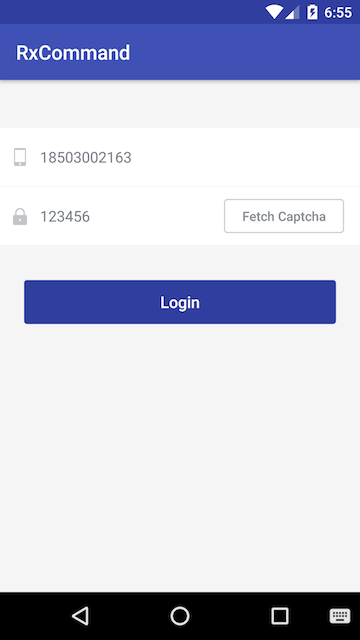

# RxCommand
A lightweight, RxJava-based library that helps ViewModel provide commands to bind to View.


## Features 

* Based on RxJava, has all the advantages of RxJava
* Separate concerns, easy to selectively handle the state of task execution (enabled,executing, error, completion, etc.)
* Make your business logic code centralized for easy reading and maintenance

## How to use 

### Demo

 

Suppose we need to make a login page.

* When the phone number is illegal, the FETCH CODE button is disable
* When the verification code is being acquired, the FETCH CODE button is disable and displays loading
* When fetching verification code  successfully, the countdown starts, the FETCH CODE button is still disable, the countdown ends, the button is available again
* When fetching verification code failed, the countdown is not started and the FETCH CODE button restores the available state
* When the phone number and verification code are valid, the LOGIN button is  clickable, otherwise it can not be clicked
* When starting login command, the LOGIN button is in disable state, and a loading showing.
* When the login  successful, hide loading, jump to the MainActivity.
* When the login failed, stop loading and prompt for an error.

Let us look at, to achieve the above needs, LoginActivity how to write

```java
//bind the user input to the ViewModel
RxTextView.textChanges(phoneNumberEditText).subscribe(viewModel.phoneNumber());
RxTextView.textChanges(verificationCodeEditText).subscribe(viewModel.verificationCode());

//bind commands to corresponding button, 
//when the command is being executed or the input is illegal, 
//the button will be disable 
RxCommandBinder.bind(verificationCodeButton, viewModel.verificationCodeCommand());
RxCommandBinder.bind(loginButton, viewModel.loginCommand());

//handle the executing state of fetching verificatoin code
viewModel.verificationCodeCommand()
        .executing()
        .subscribe(executing -> {
            if (executing) {
                verificationCodeButton.setText("fetch...");
            } else {
                verificationCodeButton.setText("fetch code");
            }
        });

//handle the success of fetching a verification code, 
//no need to deal with the failure here, because command had separate the concerns.
viewModel.verificationCodeCommand()
        .switchToLatest()
        .observeOn(AndroidSchedulers.mainThread())
        .subscribe(result -> Toast.makeText(LoginActivity.this, result, Toast.LENGTH_LONG).show());

//handle the countdown running state
viewModel.countdownCommand()
        .switchToLatest()
        .observeOn(AndroidSchedulers.mainThread())
        .subscribe(s -> verificationCodeButton.setText(s));

//handle the countdown finished state
viewModel.countdownCommand()
        .executing()
        .subscribe(executing -> {
            if (!executing) {
                verificationCodeButton.setText("fetch code");
            }
        });

//handle the login executing state
viewModel.loginCommand()
        .executing()
        .subscribe(executing -> {
            if (executing) {
                loginButton.setText("login...");
            } else {
                loginButton.setText("login");
            }
        });

//handle failed login or obtaining a verification code failed
Observable.merge(
        viewModel.verificationCodeCommand().errors(),
        viewModel.loginCommand().errors())
        .subscribe(throwable ->
                Toast.makeText(LoginActivity.this, throwable.getLocalizedMessage(), Toast.LENGTH_LONG).show()
        );

//handle the login success result
viewModel.loginCommand()
        .switchToLatest()
        .observeOn(AndroidSchedulers.mainThread())
        .subscribe(success -> {
            if (success) {
                Toast.makeText(LoginActivity.this, "login success!! Now goto the MainActivity.", Toast.LENGTH_LONG).show();
            } else {
                Toast.makeText(LoginActivity.this, "login fail!!", Toast.LENGTH_LONG).show();
            }
        });
``` 

From the above example we can see that RxCommand effectively separates the common concerns of asynchronous tasks such as enabled, executing, success, and error so that we can handle them selectively. To achieve this function, how many lines of code 
 need to write in ViewModel ? just 110 lines.

### Usage

```gradle
buildscript {
	repositories {
	    jcenter()
	}
}
``` 

```gradle
dependencies {
    compile 'com.android.support:appcompat-v7:25.2.0'
    compile 'io.reactivex.rxjava2:rxjava:2.1.0'
    compile 'io.reactivex.rxjava2:rxandroid:2.0.1'
    compile 'com.shundaojia:rxcommand:1.1.1'
}
```
